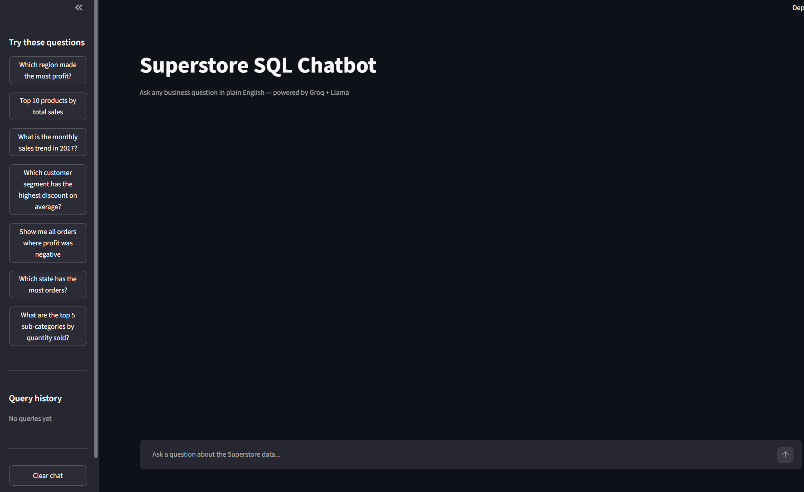
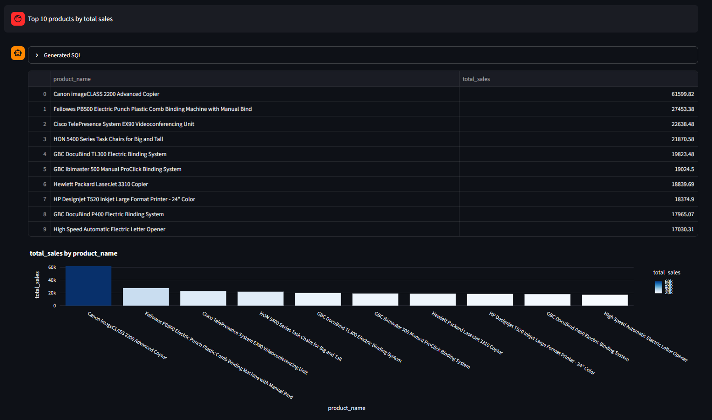
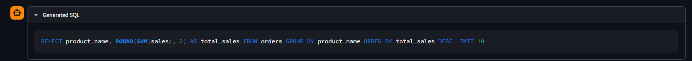
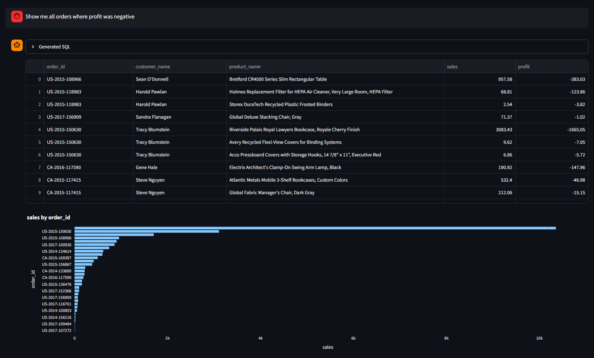
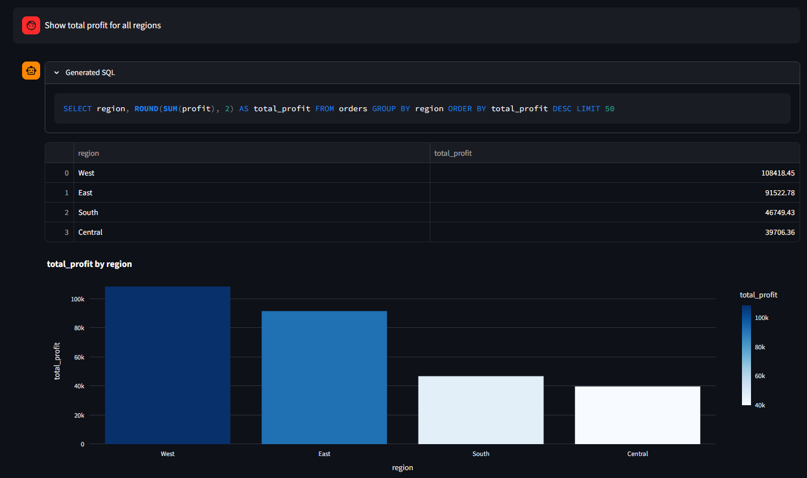

# Superstore SQL Chatbot — LLM-Powered Analytics

An AI-powered chatbot that lets you query a retail sales database using plain English.
Type any business question and the app generates SQL, runs it, and visualizes the results instantly.


---

## What It Does

- Accepts natural language questions like *"Which region made the most profit?"*
- Uses **Llama 3.3 70B via Groq API** to generate accurate SQLite queries
- Executes queries against a **9,994-row Superstore sales database**
- Returns results as an interactive **dataframe + auto-generated Plotly chart**
- Includes a **query history panel** and **safety validator** to block destructive SQL

---

## Key Findings from the Data

| Question | Answer |
|----------|--------|
| Most profitable region | West ($108K+ profit) |
| Top product by sales | Canon ImageCLASS 2200 (~$60K) |
| State with most orders | California (2,001 orders) |
| Orders with negative profit | 1,871 rows (18.7% of all orders) |

---

## Tech Stack

| Layer | Technology |
|-------|-----------|
| UI | Streamlit |
| LLM | Llama 3.3 70B via Groq API |
| Database | SQLite |
| Data processing | Pandas |
| Visualization | Plotly Express |
| Environment | python-dotenv |

---

## Project Structure

llm-sql-chatbot/

├── app.py           # Main Streamlit app + LLM integration

├── schema.py        # Database schema + prompt engineering

├── database.py      # CSV to SQLite loader

├── data/

│   └── superstore.csv

├── requirements.txt

└── .env             # API key (not pushed to GitHub)

---

## How to Run Locally

**1. Clone the repo**
```bash
git clone https://github.com/aryzus/llm-sql-chatbot.git
cd llm-sql-chatbot
```

**2. Create and activate virtual environment**
```bash
python -m venv venv
venv\Scripts\activate      # Windows
source venv/bin/activate   # Mac/Linux
```

**3. Install dependencies**
```bash
pip install -r requirements.txt
```

**4. Add your API key**

Create a `.env` file:
GROQ_API_KEY=your-groq-api-key-here
Get a free key at [console.groq.com](https://console.groq.com)

**5. Add the dataset**

Download [Superstore dataset](https://www.kaggle.com/datasets/vivek468/superstore-dataset-final),
rename to `superstore.csv` and place in the `data/` folder.

**6. Run the app**
```bash
python -m streamlit run app.py
```

---

## Example Questions You Can Ask

- Which region made the most profit?
- Top 10 products by total sales
- What is the monthly sales trend in 2017?
- Which customer segment has the highest discount on average?
- Show me all orders where profit was negative
- Which state has the most orders?
- What are the top 5 sub-categories by quantity sold?

---

## Architecture
User Input (plain English)

↓

Streamlit UI

↓

Groq API — Llama 3.3 70B (schema injected as system prompt)

↓

SQL Safety Validator (blocks DROP/DELETE/UPDATE)

↓

SQLite Database (9,994 rows, 21 columns)

↓

Pandas DataFrame + Plotly Chart

---

## Skills Demonstrated

- **Prompt engineering** — schema injection, few-shot SQL generation
- **LLM API integration** — Groq + Llama 3.3 70B
- **SQL** — dynamic query generation and execution
- **Data visualization** — auto-chart selection based on query type
- **Streamlit** — multi-component UI with session state management


## Demo





